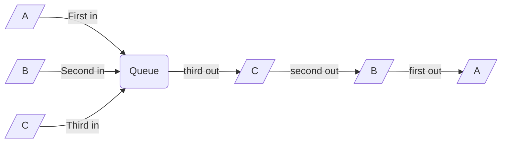
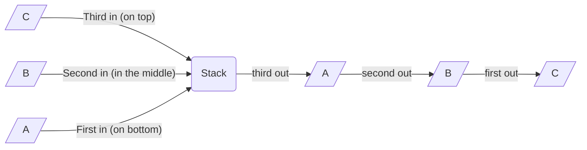
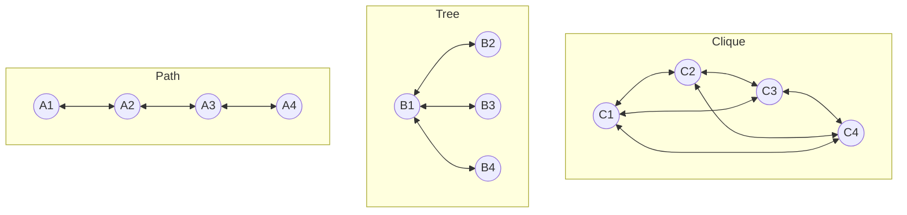

# Collections.js
JavaScript library implementing C# collections and data structures

## Queue
Queue is a **FIFO** (**F**irst **I**n - **F**irst **O**ut) data structure, focusing on it's oldest element.



### Methods:
- **`clear()`** - erases all elements
- **`contains(object)`** - returns `true` if object exists in the queue
- **`dequeue()`** - removes the oldest element
- **`enqueue(object)`** - adds an object at the end of the queue
- **`isEmpty()`** - returns `true` if there are no elements in the queue
- **`length()`** - returns number of elements
- **`peek()`** - returns the oldest element
- **`values()`** - returns shallow copy of the queue content

### Example:

```javascript
const q = new Queue()
const str = "Hello world!";

for (let i = 0; i < str.length; i++) {
    q.enqueue(str[i])
}

while (!q.isEmpty()) {
    const element = q.peek()
    q.dequeue()
    console.log('Queued element: [', element, ']')
}
```

## Stack
Stack is a **FILO** (**F**irst **I**n - **L**ast **O**ut) data structure, focusing on it's last element.



### Methods:
- **`clear()`** - erases all elements
- **`contains(object)`** - returns `true` if object exists in the stack
- **`isEmpty()`** - returns `true` if there are no elements in the stack
- **`lastIndex`** - returns index of the element on top
- **`length()`** - returns number of elements
- **`peek()`** - returns the element on top
- **`pop()`** - removes the element on top of the stack and returns it
- **`push(object)`** - adds an object on top of the stack
- **`values()`** - returns shallow copy of the stack content

### Example:
```javascript
const s = new Stack()
const str = "!never odd or eveN"

for (let char of str) {
    if (char != ' ') {
        s.push(char)
    }
}

let output = ''

while (!s.isEmpty) {
    const element = s.pop()
    output += element + ' '
}

console.log(output)
```

## Graph
Graph is a mathematical structure based on unique elements (nodes / vertices) and connections between them (edges). Groups of vertices connected by edges (groups / components) may assemble into paths, trees or cliques.



### Methods:
- **`addEdge(A, B, mutual)`** - adds a connection from A to B (directed), and vice versa if `mutual` is `true` (undirected)
- **`addNode(node)`** - adds orphan node to the graph
- **`addNodes(nodes, connected)`** - adds multiple nodes to the graph, and connects them with each other, if `connected` is set to `true`
- **`clear()`** - erases all nodes and vertices
- **`contains(node)`** - returns `true` if node exists in the graph
- **`findConnectedComponents()`** - finds all groups of connected nodes (2 or more)
- **`getEdges(node)`** - returns array of all nodes connected to the specified node
- **`isConnected(A, B)`** - returns `true` if edge from node A to node B exists
- **`isEmpty()`** - returns `true` if there are no elements in the graph
- **`isOrphan(node)`** - returns `true` if node isn't connected to anything
- **`length()`** - returns number of elements

### Example:

```javascript
var g = new Graph();

// Single node
g.addNode(1)

// Multiple nodes
g.addNodes([2, 3, 6])

// Directional (one-sided) edge
g.addEdge(1, 2)

// Undirectional (two-sided) edge
g.addEdge(3, 6, true)

// Multiple nodes connected with each other (clique)
g.addNodes([8, 9, 10], true)

// Display graph
g.display();

// Display groups
console.log(g.findConnectedComponents())
```

## BitArray

Bit array is a compact, space-efficient data structure for storing binary data. Allows to compress 8 boolean values into 1 byte.

| Byte |     0 |     1  |       2 |   ... |
|------|-------|--------|---------|-------|
| Bits | 0 - 7 | 8 - 15 | 16 - 23 | 24... |

For example, bool array will store 10 boolean values on 10 bytes (80 bits), while bit array will store them on 2 bytes (16 bits: 10 used, 6 unused).

### Methods:
- **`clear()`** - resets the bit array to initial state (`false (0)` on all bits)
- **`display()`** - prints the bit array to the console
- **`get(index)`** - returns the value of the bit at the specified index (`false (0)` or `true (1)`)
- **`isEmpty()`** - returns `true` if array stores no bits
- **`length()`** - returns the number of stored bits
- **`reset(index)`** - resets the bit at the `index` to `false (0)`
- **`set(index)`** sets the bit at the `index` to `true (1)`
- **`setBit(index, value)`** - sets the bit at the index to the specified value (`true (1)` / `false (0)`)
- **`values()`** - returns a shallow copy of stored values array

### Example:

```javascript

const bitArray = new BitArray(5); // 5 bits stored on 1 byte
bitArray.set(3);
bitArray.set(4);
bitArray.set(5);
bitArray.reset(3);
bitArray.display();

console.log(bitArray.get(5)); // true (1)
console.log(bitArray.get(3)); // false (0)
```

## Roadmap
1. Priority Queue
2. Binary Tree

## License

[](https://github.com/Naereen/StrapDown.js/blob/master/LICENSE)

## Copyright

Copyright © 2025 Adrian P. (Adisoreq)
